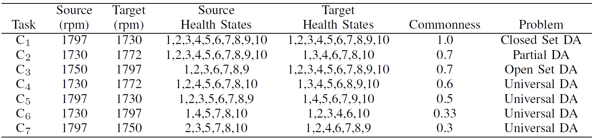
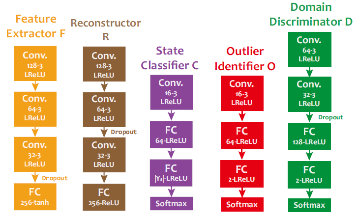
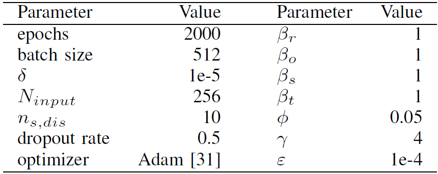
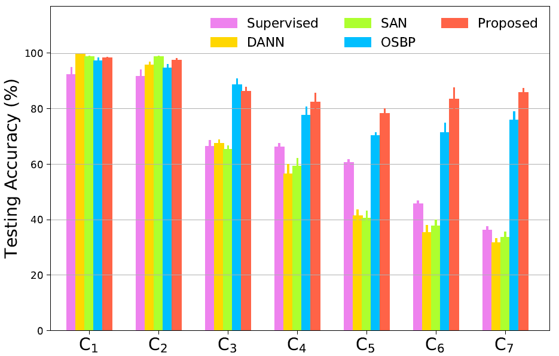

# 论文复现-Universal Domain Adaptation in Fault Diagnostics with Hybrid Weighted Deep Adversarial Learning

## 一、理论细节

### 1.1 源域的类别权重

#### 1.1.1 源域的类别权重（距离)

1. 计算源域该类数据在特征域的中心：
   $$
   c_j^s=\frac{1}{n_j^s}\sum_{x_i^s\in^{s,j}}{F(X_j^s)}
   $$
   
2. 计算该中心与目标域中心的L1距离：
   $$
   d_j^s=|c_j^s-\bar{c}^t|_{L_1}
   $$

3. 计算源域的类别权重（distance)：
   $$
   w_j^s,d=\frac{1}{d_j^s}
   $$

#### 1.1.2 源域的类别权重（分类难度)

计算源域的类别权重（分类难度)，即该类在分类损失中的均值：
$$
w_j^s,e=\frac{1}{n_j^s}\sum_{x_i^s\in D_j^s}L_d{(D(F(x_i^s)))}
$$

#### 1.1.3 权重归一化并合并

1. 归一化
   $$
   \hat{w}_j^{s,d}=\gamma \frac{w_j^{s,d}-{w}_{min}^{s,d}}{w_{max}^{s,d}-{w}_{min}^{s,d}+\epsilon},\qquad
   \hat{w}_j^{s,e}=\gamma \frac{w_j^{s,e}-{w}_{min}^{s,e}}{w_{max}^{s,e}-{w}_{min}^{s,e}+\epsilon}
   $$

2. 合并
   $$
   w_j^s=\hat{w}_j^{s,d}+\hat{w}_j^{s,e}
   $$
   j是类别次序，同一类源域样本，共享同一权重

### 1.2 目标域的实例权重

#### 1.2.1 目标域的实例权重（距离)

找到与目标域样本具有最近距离的类，并计算目标域样本与该类的类中心的距离，从而获得距离权重：
$$
w_k^{t,d}=\frac{1}{d_{k,min}^t},\qquad d_{k_min}^t = \min_{j=1,2,\dots,|Y_s|}\|F(x_k^t)-c_j^s\|_1
$$

#### 1.2.2 目标域的实例权重（分类难度)

同样，分类难度权重有：
$$
w_k^t,e=L_d{(D(F(x_k^t)))}
$$

#### 1.2.3 权重归一化并合并

1. 归一化如上

2. 合并如上
   $$
   w_k^t=\hat{w}_k^{t,d}+\hat{w}_k^{t,e}
   $$
   j是实例次序，不同的目标域样本，对应不同的权重

## 1.3 模型

#### 1.3.1 模型结构

​	模型框架包括：特征提取器**F**、分类器**C**、辨别器**D**、重构器**R**、异常数据识别器**O**。

​	前面计算出的$w_j^s$和$w_k^t$用于让辨别器专注于共享类的辨别损失。

#### 1.3.2 监督学习

1. 分类损失：
   $$
   L_c=-\sum_{i=1}^{n_s}\sum_{k=1}^{|Y_s|}1\{y_i^s=k\}\log{\frac{e^{x_{c,i,k}^s}}{\sum_{m=1}^{|Y_s|} e^{x_{c,i,k}^s}}}
   $$
   源域数据，参与分类损失

2. 初步辨别损失:
   $$
   L_d=-\sum_{i=1}^{n_s+n_t}\sum_{k=1}^{2}1\{p_i=k\}\log{\frac{e^{x_{d,i,k}}}{\sum_{m=1}^{2} e^{x_{d,i,k}}}}
   $$
   源域数据和目标类数据，均参与初步辨别损失

3. 异常数据识别损失：
   $$
   L_{o,i}=-\sum_{x\in S_{pseudo}}\sum_{k=1}^{2}1\{o_i=k\}\log{\frac{e^{x_{o,i,k}}}{\sum_{m=1}^{2} e^{x_{o,i,k}}}}
   $$
   目标类数据，参与异常数据识别损失。$o_i$来源为，将目标数据按实例权重从大到小排列，较小的$\phi$比例样本被认为是outlier

#### 1.3.3 编码损失

1. 信息保存损失：

$$
L_r=\sum_{i=1}^{n_s}\|x_i^s-R(F(x_i^s))\|_1+\sum_{i=1}^{n_t}\|x_i^t-R(F(x_i^t))\|_1
$$

源域数据和目标类数据，均参与辨别损失，信息越相似，损失越小

#### 1.3.4 辨别损失

​	将权重考虑进辨别损失：

**源域类别-辨别损失**：
$$
L_{d,s}=\sum_{j=1}^{|Y_s|}\sum_{x_i^s\in D_j^s}w_j^sL_d{(D(F(x_i^s)),p_s)}
$$
**目标域实例-辨别损失**：
$$
L_{d,t}=\sum_{i=1}^{n_t}w_i^t L_d{(D(F(x_i^t)),p_t)}
$$

#### 1.3.5 优化过程

1. 优化目标
   $$
   \begin{align*}
   	\hat{\theta}_F &= \arg\{\min_{\theta_F}{L_c+\beta_r L_r+\beta_o L_o,\quad 
   						\max_{\theta_F}{\beta_s L_{d,s}+\beta_t L_{d,t}}}\}\\
   	\hat{\theta}_D &= \arg\min_{\theta_D}{\beta_s L_{d,s}+\beta_t L_{d,t}}\\
   	\hat{\theta}_C &= \arg\min_{\theta_C}L_c\\
   	\hat{\theta}_O &= \arg\min_{\theta_O}\alpha_o L_o\\
   	\hat{\theta}_R &= \arg\min_{\theta_R}\beta_r L_r\\
   \end{align*}
   $$

2. 优化流程

   模型初始化，数据预处理

* for each epoch do
  * for each batch do
    * 计算分类损失$L_c$
    * 计算重构损失$L_r$
    * 计算初步辨别损失:$L_d$
    * 计算源域的类别权重$w_j^s$
    * 计算目标域的实例权重$w_k^t$
    * 计算辨别损失$L_{d,s}, L_{d,t}$
    * 根据$w_k^t$打伪标
    * 计算异常数据识别损失$L_{o,i}$
    * 更新模型参数
  * end
* end

## 二、实验细节

### 2.1 实验任务

​	CWRU数据库包括四个转速下的轴承数据：1730、1750、1772、1798 rpm，每个转速视为一个域。各域下的样本类型如下图。

| 类型编号 |  1   |  2   |  3   |  4   |  5   |  6   |  7   |  8   |  9   |  10  |
| :------: | :--: | :--: | :--: | :--: | :--: | :--: | :--: | :--: | :--: | :--: |
| 故障位置 |  H   |  O   |  O   |  O   |  B   |  B   |  B   |  I   |  I   |  I   |
| 故障程度 |  0   |  7   |  14  |  21  |  7   |  14  |  21  |  7   |  14  |  21  |

​	将其划分为如下任务：

### 2.2 实验网络模型

### 2.3 实验超参数

### 2.4 实验结果

